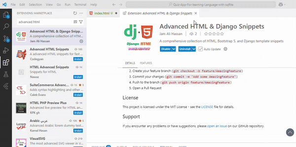
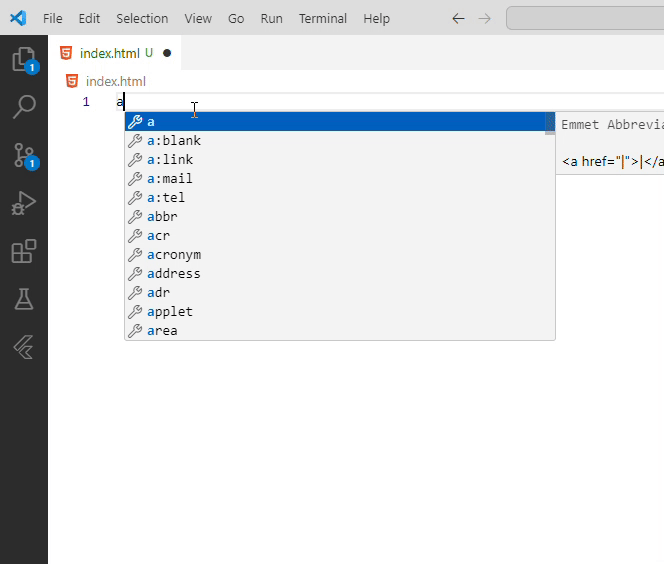
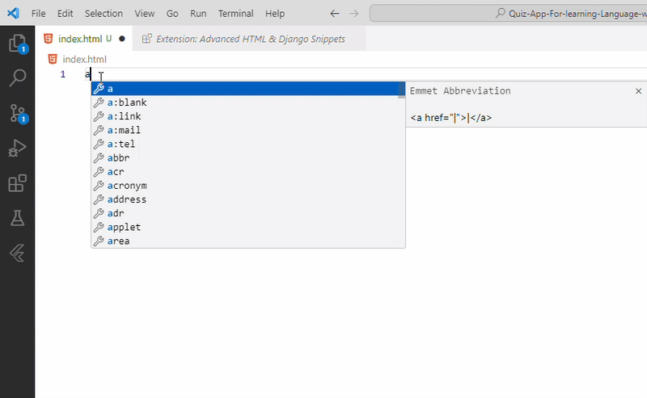
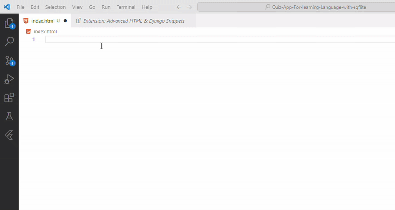

# Django HTML Snippets for VS Code

A collection of useful Django template and Python snippets for Visual Studio Code. These snippets are designed to speed up Django development by providing commonly used code patterns.

## Quick Demo

### 1. Installation and Setup

Learn how to install and set up the extension in VS Code.

### 2. HTML Basic Elements

Quick access to common HTML elements with the `h` prefix.

### 3. Django Templates

Django template tags and filters with the `ad` prefix.

### 4. Bootstrap Components

Ready-to-use Bootstrap 5 components with the `b` prefix.

### 5. Form Elements

HTML and Django form components with the `f` prefix.

### 6. Accessibility Features

Accessibility-focused components with the `acc` prefix.

### 7. Layout Components

Structural and layout elements with the `l` prefix.

### 8. SEO Elements

SEO and meta tags with the `seo` prefix.

## Features

- Django template tags and filters
- Django Python code (views, models, forms, etc.)
- Bootstrap integration
- Form handling
- Authentication templates
- Common UI patterns
- Accessibility components
- SEO optimization

## Installation

1. Install through VS Code extensions
2. Search for `Django HTML Snippets`
3. Install and reload VS Code
4. Start using snippets with their respective prefixes

## Available Snippets

### Django Template Tags (`ad` prefix)

| Prefix | Description | Example Usage |
|--------|-------------|---------------|
| `adblock` | Django template block | Create content blocks |
| `adstatic` | Django static file reference | Reference static files |
| `adfor` | Django for loop template tag | Iterate over collections |
| `adif` | Django if-else template tag | Conditional rendering |
| `adinclude` | Django include template tag | Include other templates |
| `adurl` | Django URL template tag | Generate URLs |
| `adextends` | Django extends template tag | Template inheritance |
| `adcsrf` | Django CSRF token tag | Form security |
| `adload` | Django load template tag | Load template libraries |
| `adcomment` | Django comment tag | Add comments |
| `adwith` | Django with template tag | Variable assignment |
| `adfilter` | Django filter syntax | Apply template filters |
| `adfilters` | Common Django template filters loading | Load multiple filters |
| `adform` | Form template with crispy forms | Create forms |
| `admessages` | Messages framework template | Display messages |
| `adpagination` | Bootstrap pagination template | Add pagination |
| `adnav` | Bootstrap navbar with authentication | Navigation bar |

### Django Python Code (`adp` prefix)

| Prefix | Description | Common Use Cases |
|--------|-------------|------------------|
| `adpview` | Django view function | Basic views |
| `adpmodel` | Django model class | Database models |
| `adpform` | Django form class | Form handling |
| `adpadmin` | Django admin class | Admin interface |
| `adpurls` | Django URLs configuration | URL routing |
| `adpclass` | Class-based view with login required | Advanced views |
| `adpapi` | REST framework ViewSet | API endpoints |
| `adpmiddleware` | Custom middleware class | Request/Response processing |
| `adpsignals` | Model signals | Model events |
| `adpcommand` | Management command | Custom commands |
| `adpauthviews` | Authentication views | User authentication |
| `adptests` | Test class with common test cases | Testing |

## Best Practices

### Template Organization
- Use template inheritance with `adextends` and `adblock`
- Keep reusable components in separate files
- Use `adinclude` for component reuse

### Form Handling
- Always include CSRF protection with `adcsrf`
- Use crispy forms for consistent styling
- Implement proper validation

### Security
- Use `adcsrf` in all forms
- Implement proper authentication
- Sanitize user inputs

### Performance
- Use template caching
- Implement pagination for large datasets
- Optimize database queries

## Requirements

- Visual Studio Code
- Django project
- Python environment
- (Optional) django-crispy-forms for form templates
- (Optional) Django REST framework for API snippets
- (Optional) Bootstrap 5 for UI components

## Troubleshooting

### Common Issues
1. Snippets not appearing
   - Ensure file type is correct (.html, .py)
   - Check VS Code snippet settings
   - Reload VS Code

2. Bootstrap styles not working
   - Verify Bootstrap is properly included
   - Check class names
   - Ensure proper Bootstrap version

3. Django templates not rendering
   - Check template directory settings
   - Verify template inheritance
   - Check context variables

## Contributing

Feel free to submit issues and enhancement requests! We welcome:
- Bug reports
- Feature requests
- Documentation improvements
- Code contributions

## License

This extension is licensed under the MIT License.

## Support

Need help? Check out:
- [Documentation](https://github.com/yourusername/django-html-snippets/wiki)
- [Issue Tracker](https://github.com/yourusername/django-html-snippets/issues)
- [Discussions](https://github.com/yourusername/django-html-snippets/discussions)
