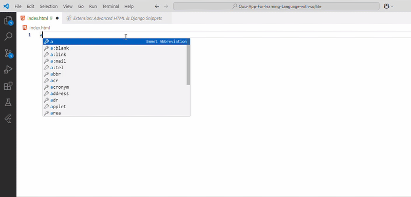
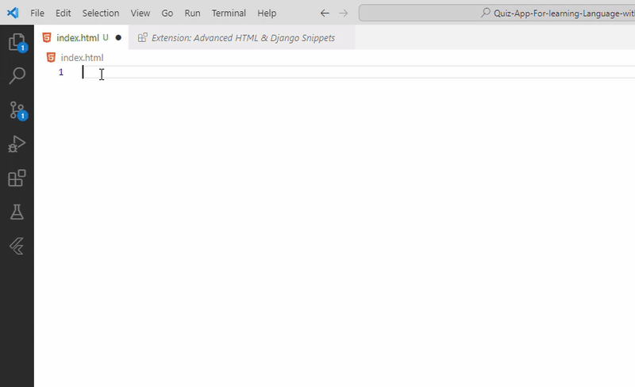
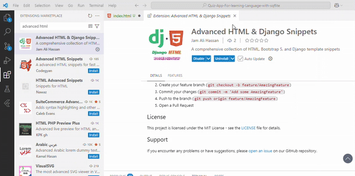
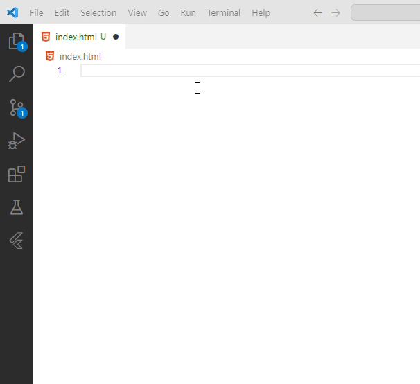
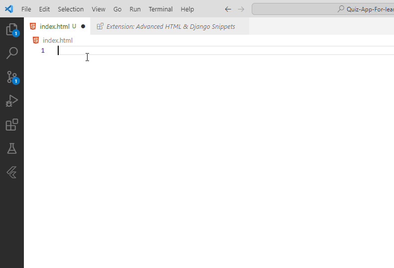
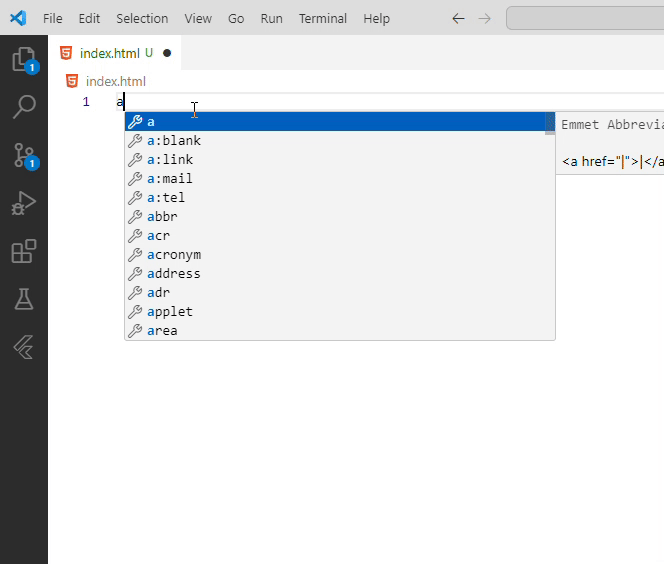
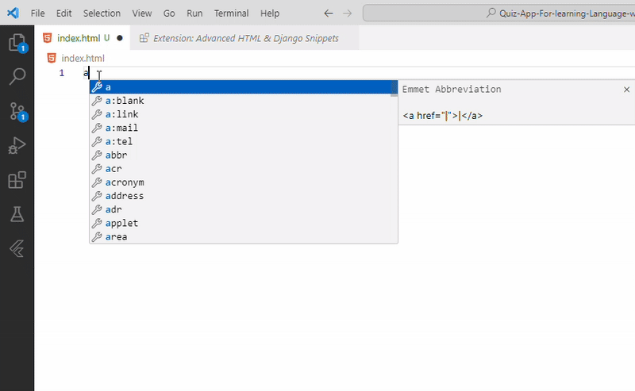
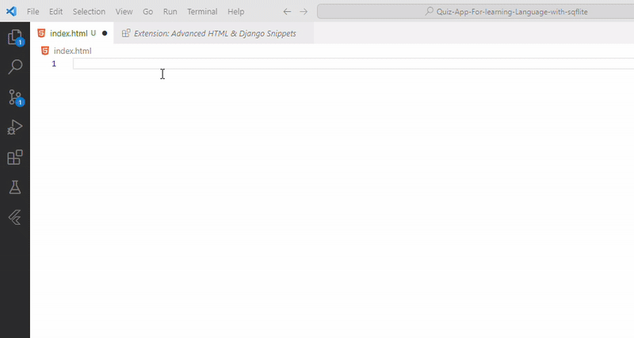

# Getting Started with Django HTML Snippets

## What's in the Extension

* `package.json` - Extension manifest and metadata
* `snippets/` - Directory containing all snippet files:
  * `snippets.json` - Main snippets file
  * `categories/` - Organized snippet categories:
    * `html-basic.json` - Basic HTML elements
    * `django-templates.json` - Django template tags
    * `bootstrap-components.json` - Bootstrap components
    * `forms.json` - Form elements
    * `layout.json` - Layout structures
    * `seo-meta.json` - SEO elements
    * `accessibility.json` - Accessibility features

## Visual Demonstrations

### 1. Installation and Setup

* Install from VS Code marketplace
* Search for "Django HTML Snippets"
* Click install and reload

### 2. HTML Basic Elements

* Use `h` prefix for HTML elements
* Common elements like div, span, p
* Semantic HTML5 elements

### 3. Django Templates

* Use `ad` prefix for Django templates
* Template tags and filters
* Template inheritance

### 4. Bootstrap Components

* Use `b` prefix for Bootstrap
* Responsive components
* Navigation elements

### 5. Form Elements

* Use `f` prefix for forms
* Input elements
* Form validation

### 6. Accessibility Features

* Use `acc` prefix for accessibility
* ARIA attributes
* Screen reader support

### 7. Layout Components

* Use `l` prefix for layout
* Grid systems
* Responsive structures

### 8. SEO Elements

* Use `seo` prefix for SEO
* Meta tags
* Social media cards

## Testing the Snippets

1. Press `F5` to open a new VS Code window with the extension loaded
2. Create a new file with the appropriate extension:
   * `.html` for HTML and Django templates
   * `.py` for Python files
3. Type the prefix to see available snippets:
   * `h` for HTML elements
   * `ad` for Django templates
   * `b` for Bootstrap
   * `f` for forms
   * `acc` for accessibility
   * `l` for layout
   * `seo` for SEO elements

## Development Workflow

1. Make changes to snippet files in `snippets/categories/`
2. Update the main `snippets.json` if needed
3. Reload VS Code (`Ctrl+R` or `Cmd+R` on Mac)
4. Test changes in appropriate file types

## Publishing Process

1. Update version in `package.json`
2. Update changelog in `CHANGELOG.md`
3. Update documentation if needed
4. Run tests if available
5. Package the extension: `vsce package`
6. Publish to VS Code Marketplace: `vsce publish`

## Best Practices

1. Snippet Organization
   * Keep related snippets in category files
   * Use consistent prefix patterns
   * Include helpful descriptions

2. Testing
   * Test in different file types
   * Verify tab stops work correctly
   * Check snippet formatting

3. Documentation
   * Keep README updated
   * Document new features
   * Include usage examples

## Resources

* [VS Code Extension API](https://code.visualstudio.com/api)
* [Django Documentation](https://docs.djangoproject.com/)
* [Bootstrap Documentation](https://getbootstrap.com/docs/)
* [Extension Publishing Guide](https://code.visualstudio.com/api/working-with-extensions/publishing-extension)

## Support

* [Report Issues](https://github.com/yourusername/django-html-snippets/issues)
* [Feature Requests](https://github.com/yourusername/django-html-snippets/issues/new)
* [Documentation](https://github.com/yourusername/django-html-snippets/wiki)